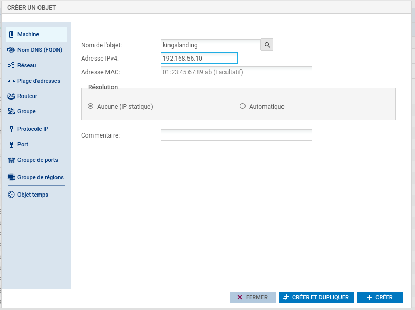
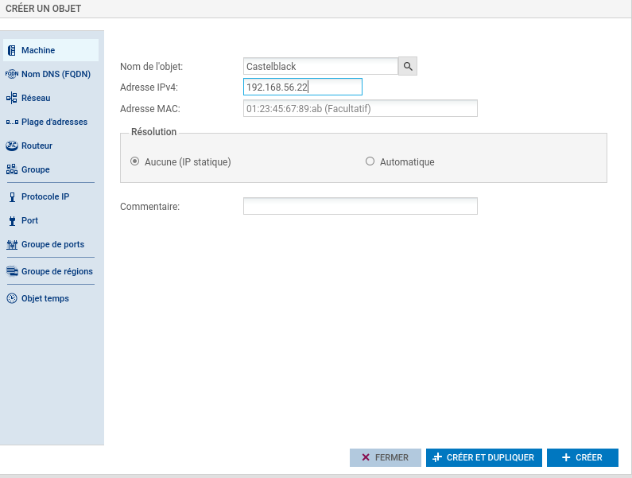
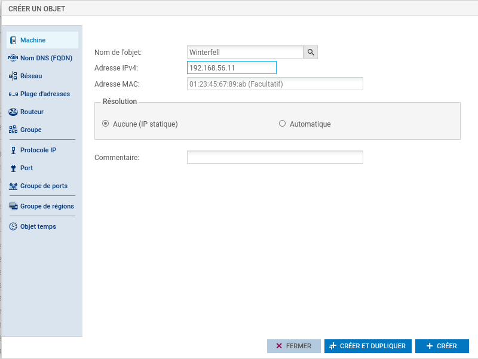
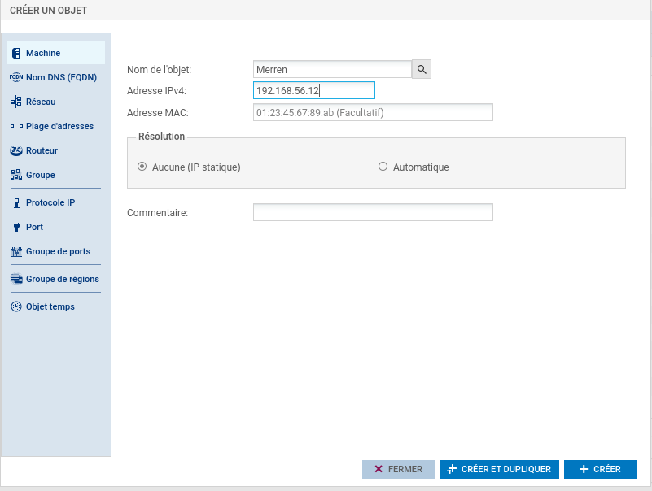
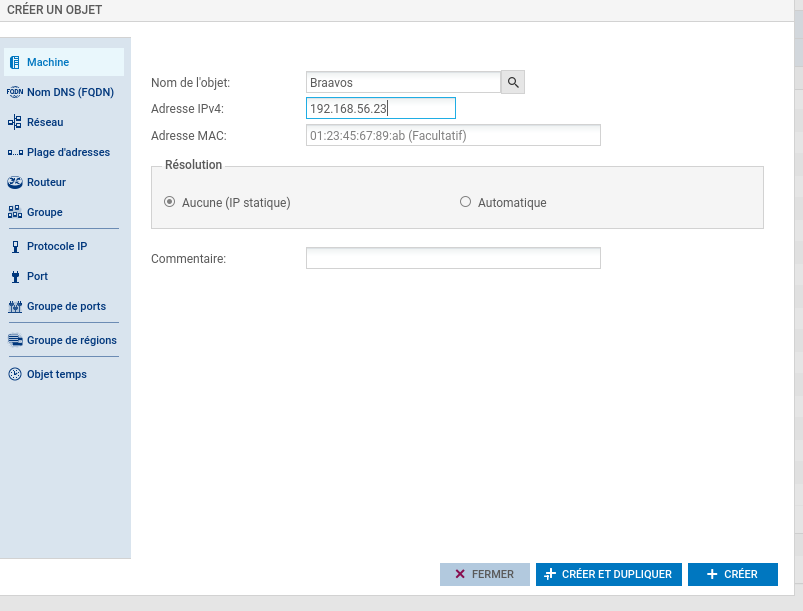
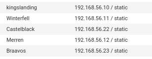
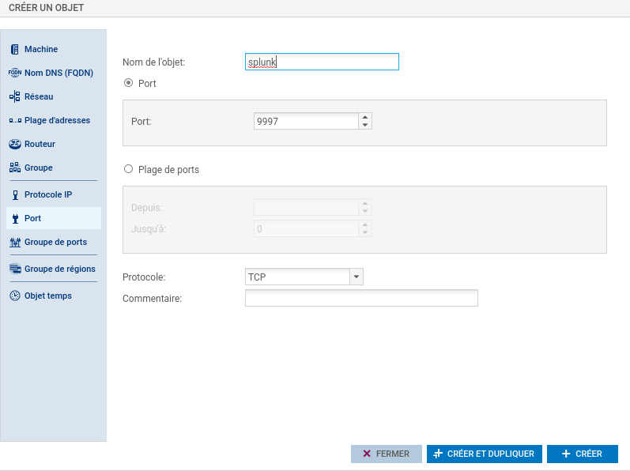
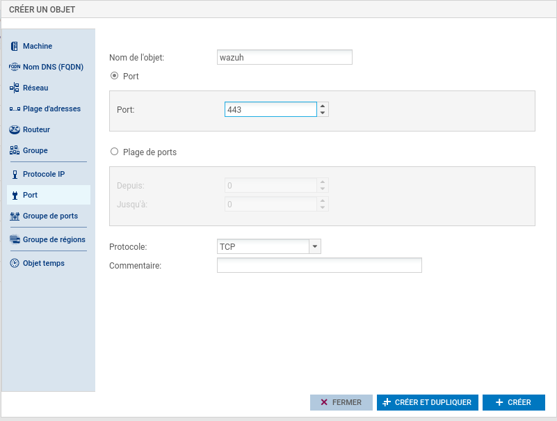
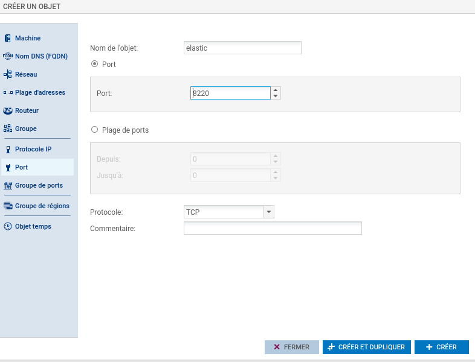
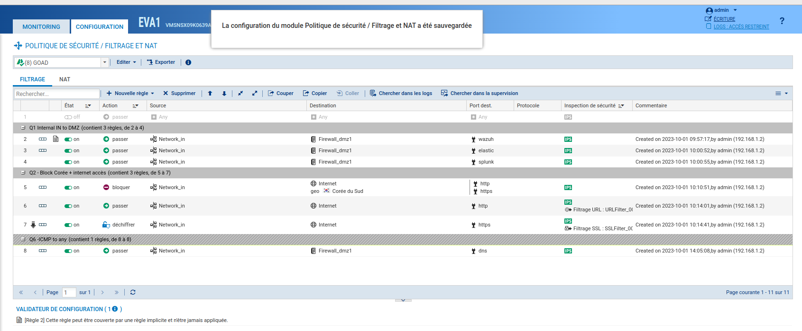

# Installation d'un firewall sur le GOAD :  

Un membre du groupe est certifié stormshield et est ameme de configurer un firewall pour protéger le GOAD depuis l'extérieure.
Comme nous l'avons montrer sur le schéma réseau nous avons placer le firewall en sortie du GOAD entre la DMZ et et le réseau local.

La matrice des flux 
 
| Source/Dest | 9200   | 8220   | 9997   | 80     | 443    | 53     |
|-------------|--------|--------|--------|--------|--------|--------|
| Internet    | x      | x      | x      | Allow  | Allow  | x      |
| DNS         | x      | x      | x      | x      | x      | Allow  |
| Wazuh       | x      | x      | x      | x      | Allow  | x      |
| Elastic     | Allow  | Allow  | x      | x      | x      | x      |
| Splunk      | x      | x      | Allow  | x      | x      | x      |

Pour le firewall j'utilise une OVA obtenue en passant les exams Stormshield : 

Voici la page de connexion : 

Une fois connecté je modifie l'axès au page d'administration : 

Je spécifie uniquement les réseaux internes à l'accès à l'administrateur (DMZ + GOAD)

Création des objets machines  :
# Kingslanding   

Castelblack 

Winterfell

Merren

Braavos 

Voici tous les objets crées : 

Création des objets en rapport avec le port  : 
### Splunk 

### Wazuh

### Elastic 

Une fois tous les objets machines créer nous allons mettre en place les règles NAT et de filtrage pour autorisé le traffic souhauté :

Nous avons accepter les requêtes du réseaux interne à la DMZ  sur les ports des SIEMS, nous avons autorisé l'accées à internet en HTTP et HTTPS (avec déchiffrement SSL). Nous avons bloquer les sites coréen (pour flex sur le Firewall)

Après quelque tentative de connexion sur des sites coréen (visitekorea.or.kr)on remarque que la règle s'active  : 

Nous n'allons pas mettre plus de configuration dans le firewall.