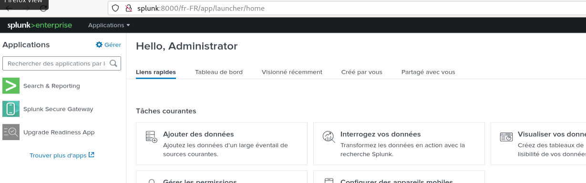
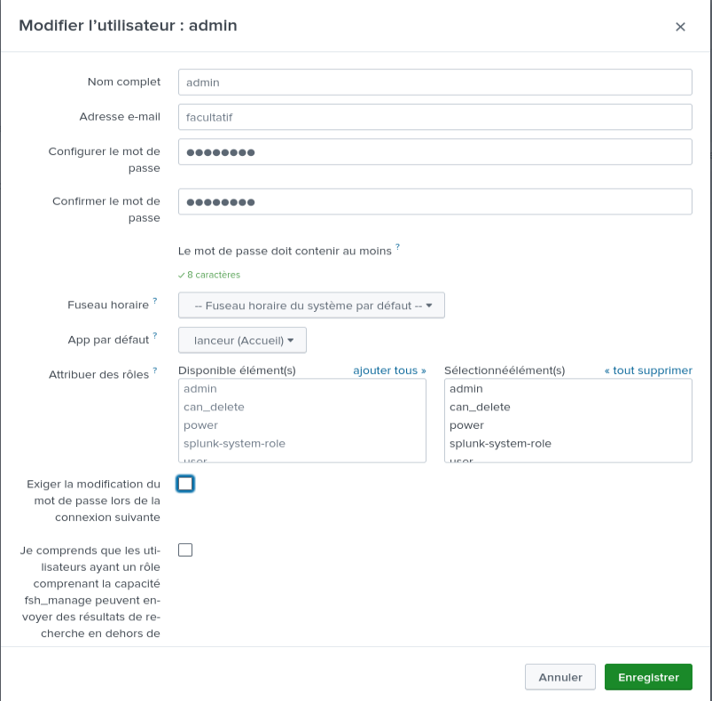
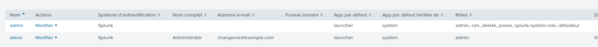
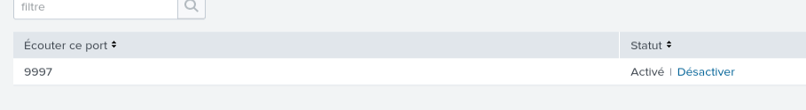
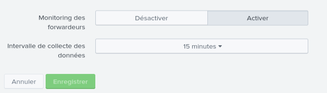
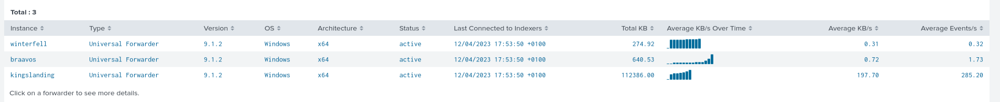

# Installation de splunk 

Création d'un compte sur :  www.splunk.com

Récupération de Splunk Entreprise  :

On lance le script d'installation : 

On se connecte via l'adresse http://splunlk:8000

Voici l'interface d'adminsitratation:

Création d'un compte administrateur  : 

Nous possedons maintenant 2 comptes adminitrateur 

Création d'un port d'écoute : le port 9997

Il faut maintenant créer un règle de firewall pour autorisé le traffic: 
(pas utile )

Je configurer la durée de l'intervalle de collecter des forwarders

Les agents remontent 

