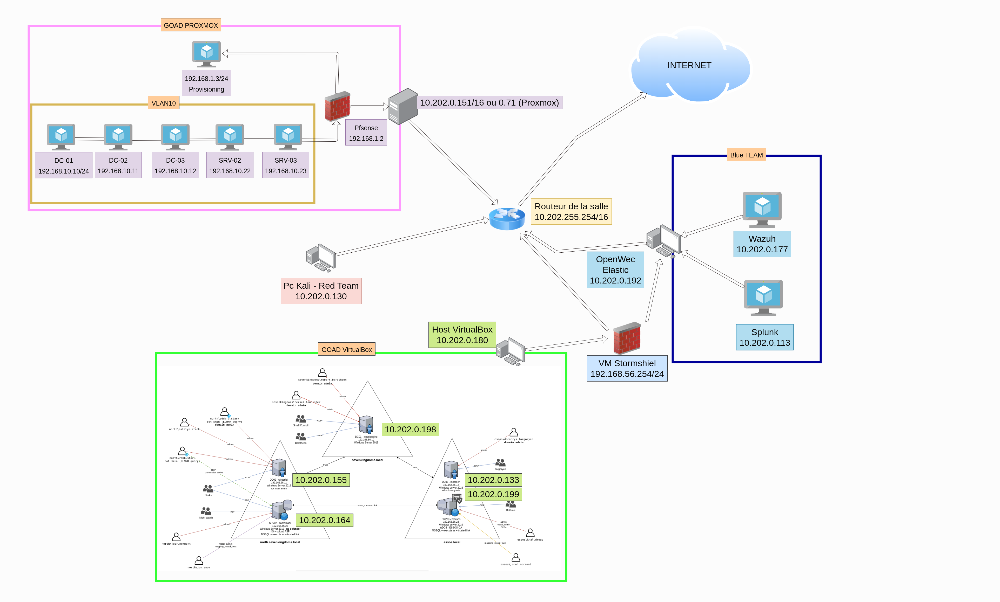
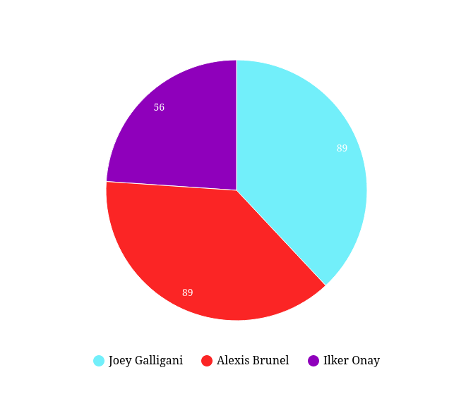
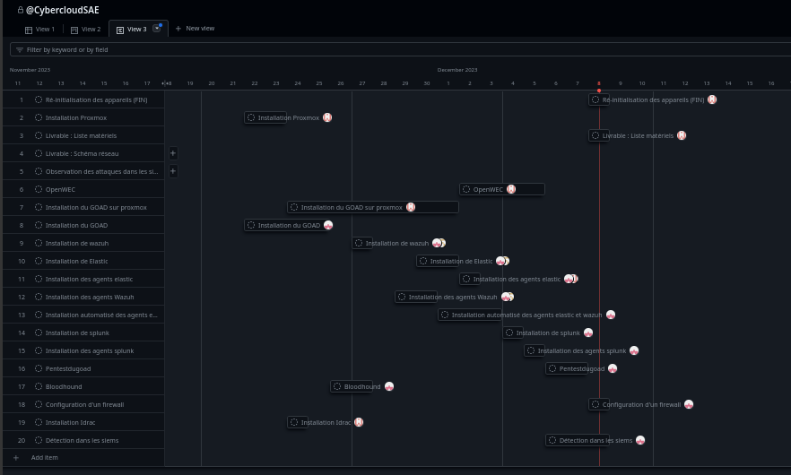

# SAE_Cloud_Cyber
 

### Les membres du groupe :  
- Joey GALLIGANI 
- Ilker ONAY 
- Alexis BRUNEL 

 

### Le schéma réseaux : 

### Les ressources : 
    
    Le sujet  :  
    https://github.com/pushou/SAE5.Cyber-Devcloud/blob/main/description.md

    L'organisation du projet  trello :
    https://trello.com/invite/b/ZjSyheL4/ATTI8e8909da187ad35a0f2dcdcb13f3da923A1C2DF6/saecybercloud

    L'organisation du projet gihub :
    https://github.com/users/AlexisBrunel/projects/1

### Récapitilatif des réussites

 - Tout d'abord nous avons lancer en parralèle GOAD sur virtualbox et proxmox des le premiers jours. Par la suite nous avons installers les différents SIEM et leur agent ( Wazuh, Elastic, OpenWEC, Splunk ).
L'équipe cyber à alors crée un plan d'attaque du réseaux pour voir le bon fonctionnement de la détection dans les différents SIEM 

Installation de Wazuh	                Ok
 

Installation de Elastic                	Ok 
 

Installation d’agent Wazuh            	Ok 
 

Installation d’agent Elastic	        Ok 
 

Automatisation d’installation d’agent	Ok 
 

Installation de Splunk                	Ok 
 

Installation d’agent splunk	            Ok 
 

Installation d’Open WEC                	Ok 
 

Installation du GOAD vitualbox	        Ok 
 

Installation du GOAD proxmox	        Ok 
 

Attaque sur le GOAD	                    Ok 
 

Détection dans les SIEM(s)             	Ok 
 

Mise en place d’un firewall 	        Ok 

###  Points bloquant : 

 - Nous n'avons pas eu assez de temps pour réaliser des tests sur Proxmox malgrès une infrastructure fonctionnelle.
Nous n'avons pas réussis à comprometre l'adminisrateur du domaine dans le pentest, manque de méthodologie, d'entrainement et de pratqique.
Difficulté aux niveaux des configurations OPENWEC.

###  Les questions :

 - Lors de l'installation d'Open Wec, un problème était survenue lors de la création de la clé, alors une question à été poser à l'enseignant Mr.Pouchoulon, la réponse à été de définir l'utilisateur dans le fichier /etc/openwec/openwec.conf le même domaine que le DC ou le SRV

### Les annexes : 
    - Un dossier Installation 
    - Un dossier Red Team 
    - Un dossier Blue Team 
    - Un dossier Livrables 

#### Dossier Installation 
    - Installation Splunk
    - Installation Elastic
    - Installation Wazuh
    - Installation Openwec
    - Ansible_agent
    - Goad_Virtualbox
    -  Installation GOAD Proxmox
    - Elastic agent déploiement 
    - Installation d'un Kali linux pour la redteam
    
#### Dossier Blue Team 
    - Détection des menances dans les siems 
#### Dossier Red Team 
    - Dossier Bloodhound
    - Attaque sur le goad
    
#### Dossier livrable 
    - Schéma réseau 
    - Un dossier de sauvegarde
    - Un bilan des heures 

## Organisation du projet  : 

#### Quantification du travail :

/!\    Il faut prendre en compte que les étudiants cyber ont eux plus d'heure pour le projet sans compter les abscences ( Ilker abscent 2 jours - 1 jours TP avec Maxime Calves)    /!\
 

Cyber  : 

89 heures passé par les cybers sur le projet : 

    - 20 heures pour le GOAD (virtualbox | durée des téléchargements)
    - 8  heures pour l'installation des siems ( Wazuh | Elastic )
    - 7  heures pour le déploiement des agents ( Wazuh | Elastic )
    - 15 heures pour l'automatisation des agents ( Wazuh | Elastic | Installation du GOAD)(désinstallation des agents)
    - 15 heures pour l'installation du siem splunk et des agents 
    - 20 heures pour l'attaque du GOAD
    - 20 heures pour la détection des attaques

Cloud : 

56 heures passé pour le cloud sur le projet :(2 jours d'absence + 1 journnée de TP avec Maxime Calves)

    - 2  heures pour l'installation de proxmox
    - 31 heures pour l'installation du GOAD sur proxmox
    - 18 heures pour openWEC
    - 4  heures compte rendu d'installation et schéma réseau
    - 1  heure  désinstallation proxmox et du GOAD 

15 heures à la masion pour la rédaction des rapports 
2 heures au total pour la réalisation  des dayly(s)

 

#### Partage du travail :
Pour partager les différentes tâches nous avons utilisées un trello et organiser des dailys, pour pouvoir répartir les tâches nous avons utiliser la méthode Kanban ( A faire | En cours | Fini )
 
Dans un premier temps on a du lister toute les différentes tâches pour quantifier et s'organiser au mieux dans la priorité des différentes tâches ( par exemple commencer par GOAD sur Virtualbox car l'installation était plus rapide ).
 
Le lien vers le trello : https://trello.com/b/ZjSyheL4/saecybercloud
 
 

#### Les livrables :
Tout les livrables sont disponibles sur le dépôts actuel github
