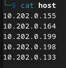
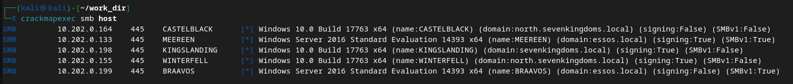
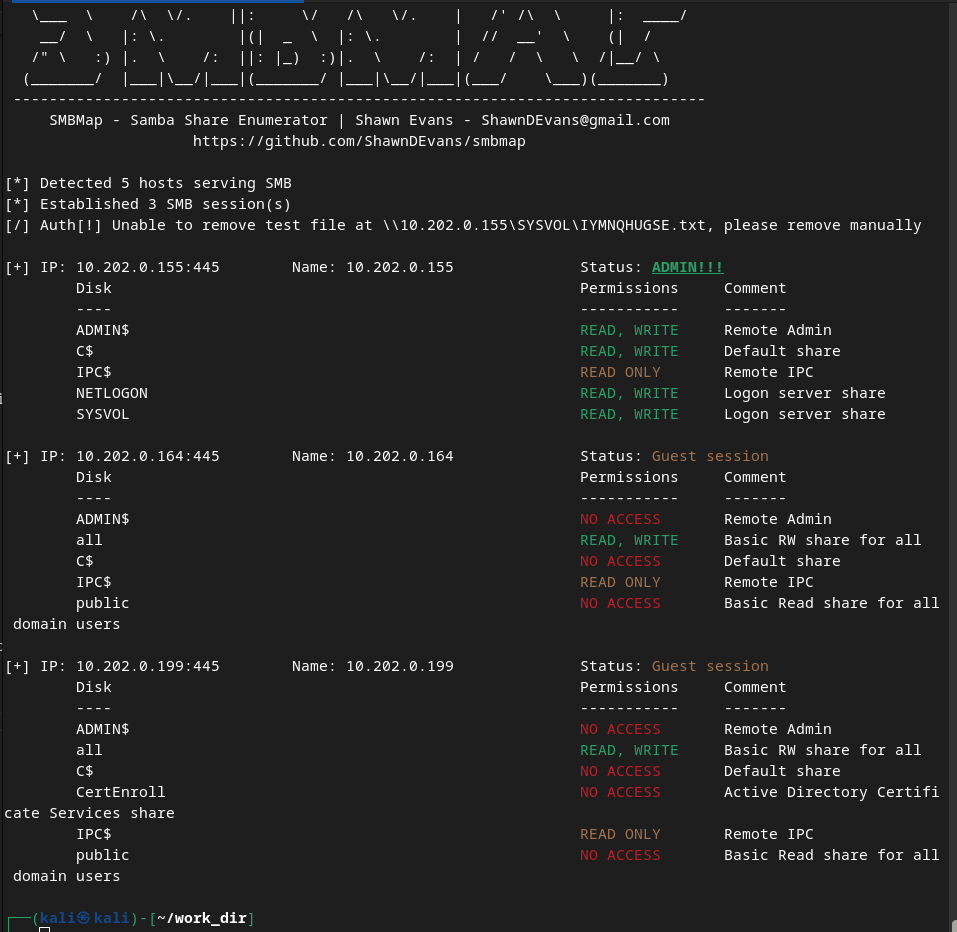
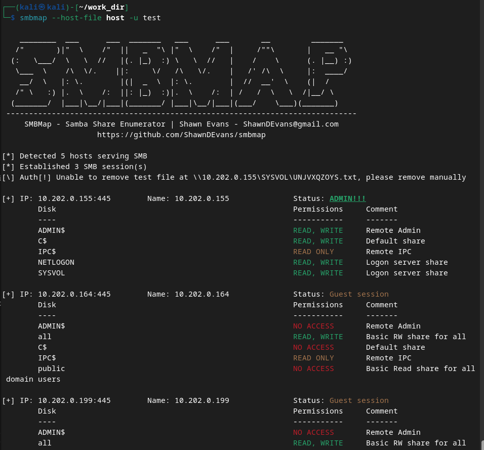
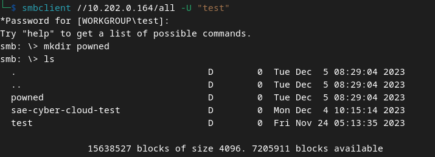
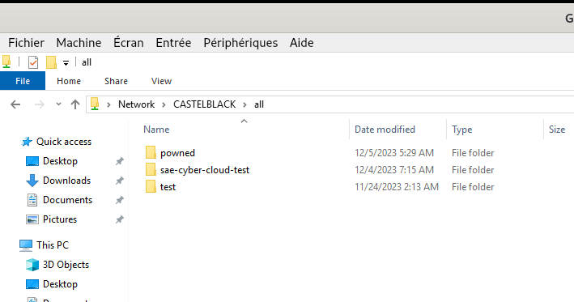
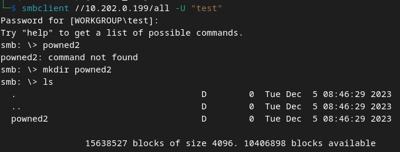
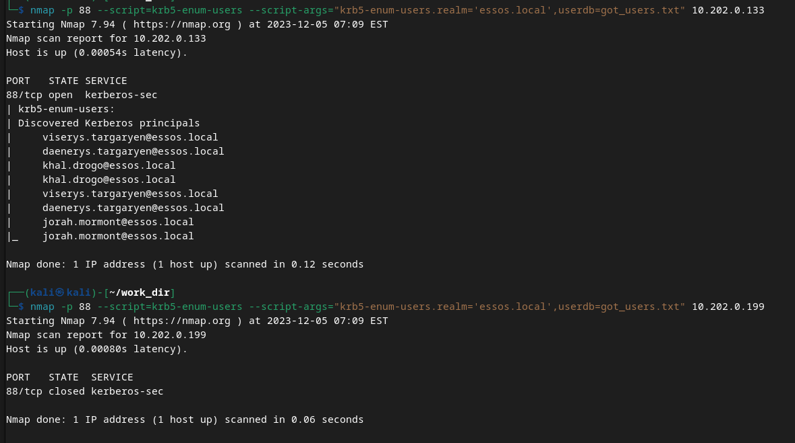
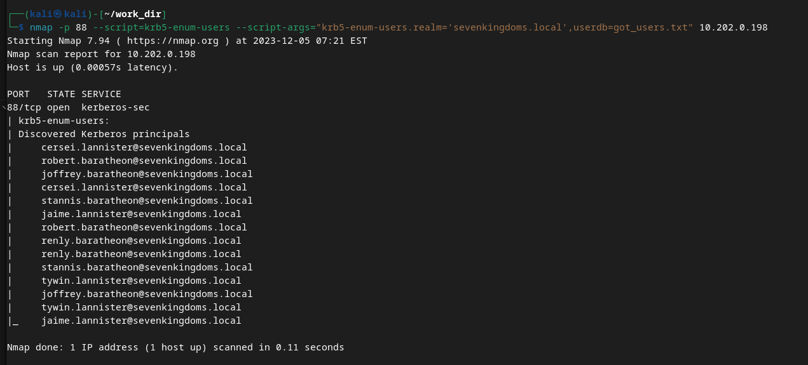
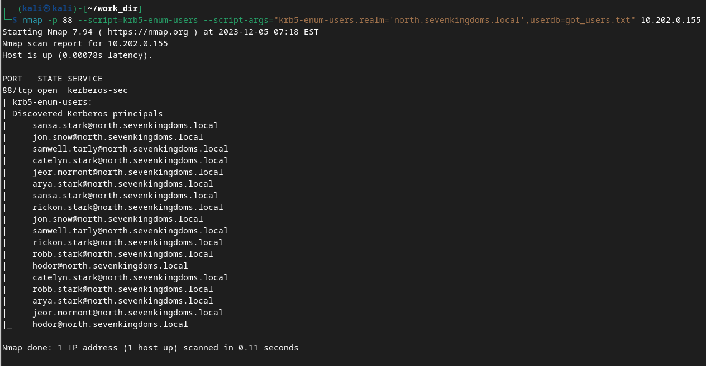

# Scan avec crackmapexec 

Je créer un fichier host qui comprend toute les adresses ip des serveurs.

Je lance scan : 

Infos récupérées : 

    Hôte CASTELBLACK (10.202.0.164) :
        Système d'exploitation : Windows 10.0 Build 17763 x64
        Nom de l'ordinateur : CASTELBLACK
        Domaine : north.sevenkingdoms.local
        Signature (signing) : Désactivée
        Protocole SMB version 1 (SMBv1) : Désactivé

    Hôte MEEREEN (10.202.0.133) :
        Système d'exploitation : Windows Server 2016 Standard Evaluation 14393 x64
        Nom de l'ordinateur : MEEREEN
        Domaine : essos.local
        Signature (signing) : Activée
        Protocole SMB version 1 (SMBv1) : Activé

    Hôte KINGSLANDING (10.202.0.198) :
        Système d'exploitation : Windows 10.0 Build 17763 x64
        Nom de l'ordinateur : KINGSLANDING
        Domaine : sevenkingdoms.local
        Signature (signing) : Activée
        Protocole SMB version 1 (SMBv1) : Désactivé

    Hôte WINTERFELL (10.202.0.155) :
        Système d'exploitation : Windows 10.0 Build 17763 x64
        Nom de l'ordinateur : WINTERFELL
        Domaine : north.sevenkingdoms.local
        Signature (signing) : Activée
        Protocole SMB version 1 (SMBv1) : Désactivé

    Hôte BRAAVOS (10.202.0.199) :
        Système d'exploitation : Windows Server 2016 Standard Evaluation 14393 x64
        Nom de l'ordinateur : BRAAVOS
        Domaine : essos.local
        Signature (signing) : Désactivée
        Protocole SMB version 1 (SMBv1) : Activé

On remarque 2 domaines : **essos.local** : **sevenkingdoms.local** et un sous domaine  : **north.sevenkingdoms.local**

On remarque du SMB (v1), il serait cool de faire des tests avec smbmap :

Voici un scan possible pour voir les sessions SMB : 

La commande  :
    
    smbmap --host-file host -u admin

Je spécifie toujours mes host(s) et un utilisateur(admin)

Je spécifie toujours mes hostd(s) et un utilisateur test

On remarque des session de partage pour les IP 10.202.0.164,10.202.0.199 et 10.202.0.199

### Pour le partage sur l'ip 10.202.0.164 

Droit : READ,WRITE 
SESSION INVITÉ 

Je créer un fichier .

Je vérifie sur la machine castelblack (Hors pentest)

On remarque que le fichier est bien créer, cela fonctionne.
### Pour le partage sur l'ip 10.202.0.199

Droit READ,WRITE  
SESSION invité 

### Pour le partage sur l'ip 10.202.0.155

Il ne semble pas être accessible depuis une session invité, nous n'avons pas de session admin, la connection est impossible.

# Liste des utilisateurs Kerberos.

## Enumération des utilisateurs Kerberos avec Nmap :

### Pour le royaume **essos.local** : 

### Pour le royaume **sevenkingdoms.local**

### Pour le domaine **north.sevenkingdoms.local**

