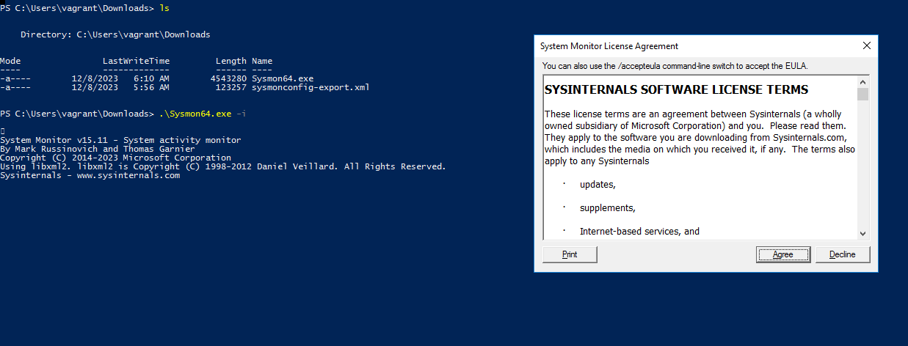
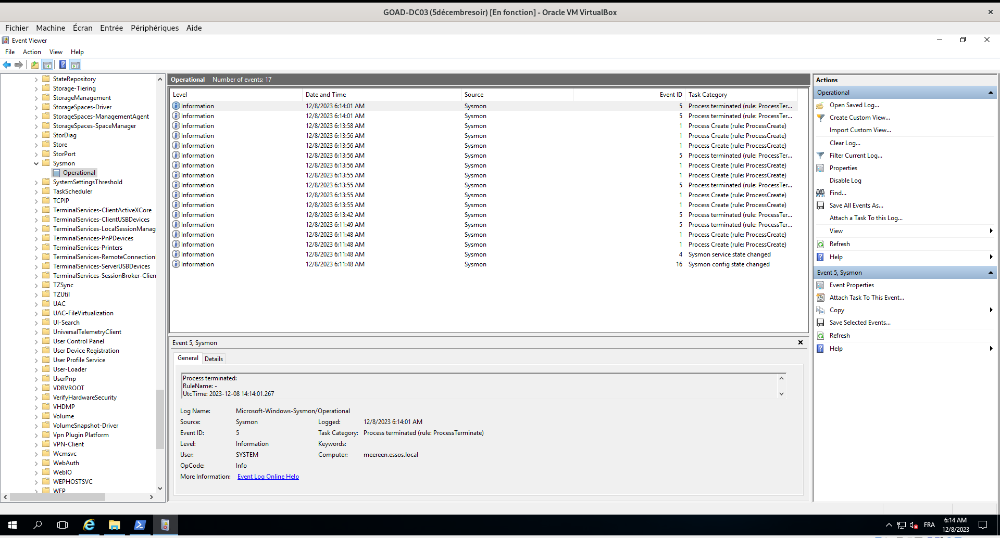

# Sysmon
<br>

### Afin de remonter d'avantage de logs sur les machines du GOAD nous avons installé sysmon sur les machines:

<br>

Après avoir télécharger le fichier **Sysmon.zip** sur le site de Microsoft puis l'avoir *décompressé* j'ai exécuté la commande :
```python
  Sysmon64.exe -i
```


<br>
<br>
#### Nous voyons bien des logs dans l'event viewer de la machine :


