# Détection sur Wazuh :
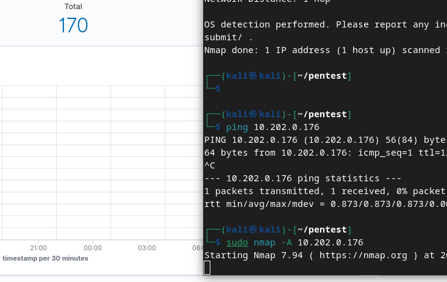

Après le scan un remarque 9 alertes.

Je supprime les faux postifis 

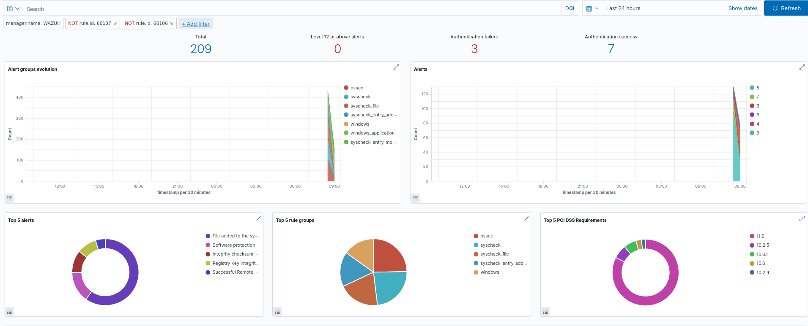

Je spécifie les 2 rule.id qui me géne car rapidement le server se remplie de connexion windows inutiles

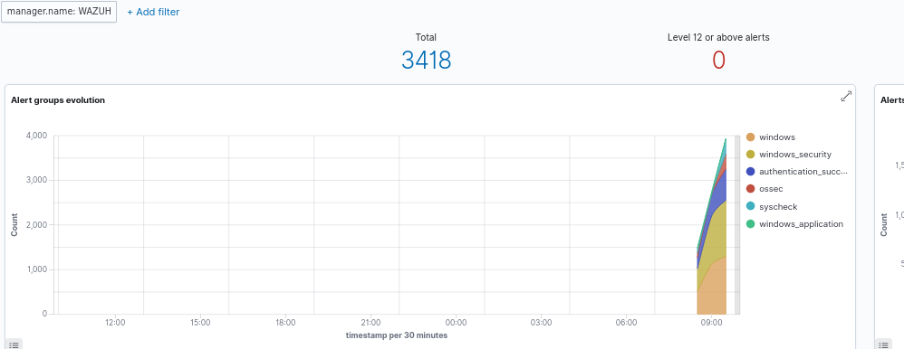

Sur le scan 

    nmap -A <ip>

On remarque des informations SQL ,je suppose que pour générer cette réponse il doit causer des erreurs sql
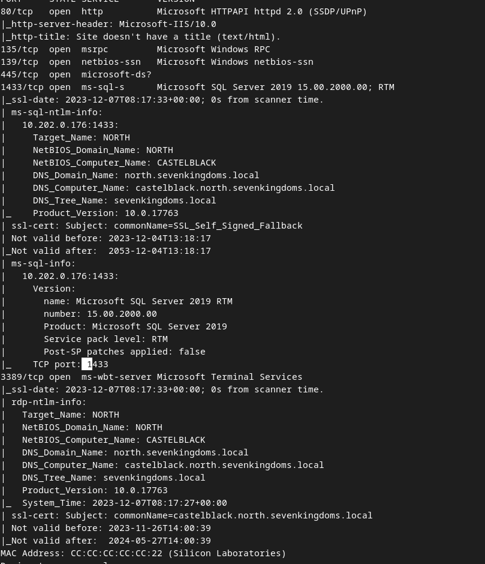
Sur le siem,on remarque une erreur sql qui correspond à la bonne heure.
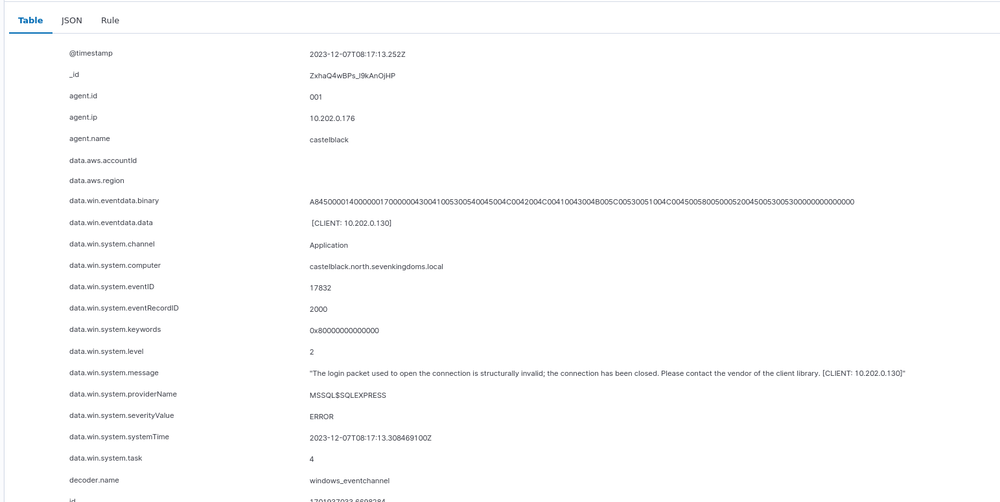

Je relance un scan namp -A pour regarder les changements

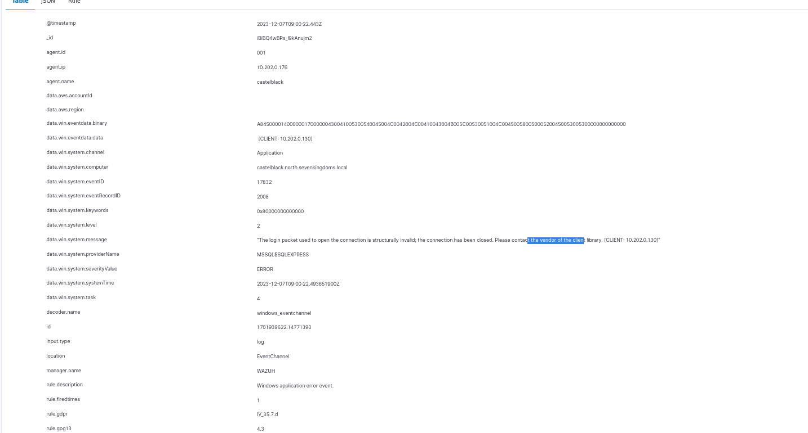

Il créer une erreur windows

Je lance des scans smb 

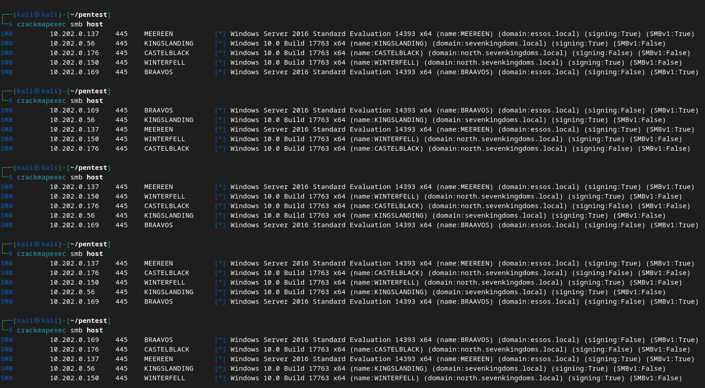

On remarque rapidement les alertes : 

En cherchant sur le site  : T1078
https://attack.mitre.org/techniques/T1078/

Les adversaires peuvent 
obtenir et abuser des informations d'identification des comptes existants afin d'obtenir un accès initial. 
l'accès initial, la persistance, l'escalade des privilèges ou l'évasion de la défense. 
Les informations d'identification compromises peuvent être utilisées pour contourner les contrôles d'accès placés sur 
diverses ressources sur les systèmes au sein du réseau et peuvent même être utilisées pour
 pour accéder de manière persistante à des systèmes distants et à des services disponibles à l'extérieur, 
tels que les VPN, Outlook Web Access, les périphériques réseau et le bureau à distance.
 Les informations d'identification compromises peuvent également accorder à un adversaire des privilèges accrus
 à des systèmes spécifiques ou l'accès à des zones restreintes du réseau. 
Les adversaires peuvent choisir de ne pas utiliser de logiciels malveillants ou d'outils en conjonction avec l'accès légitime à ces informations d'identification. 
l'accès légitime fourni par ces identifiants afin de rendre plus difficile la 
difficile de détecter leur présence.
Dans certains cas, les adversaires peuvent abuser 
comptes inactifs : par exemple, ceux qui appartiennent à des personnes qui ne font plus partie d'une organisation. 
qui ne font plus partie d'une organisation. L'utilisation de ces comptes peut permettre à l'adversaire 
d'échapper à la détection, car l'utilisateur du compte d'origine ne sera pas 
pour identifier toute activité anormale se déroulant sur son compte. 

En cherchant sur le site :T1531 https://attack.mitre.org/techniques/T1531/

Les adversaires peuvent interrompre la disponibilité des ressources du système et du réseau en empêchant l'accès aux comptes utilisés par des utilisateurs légitimes. Les comptes peuvent être supprimés, verrouillés ou manipulés (ex : modification des informations d'identification) afin d'en supprimer l'accès. Les adversaires peuvent également se déconnecter et/ou procéder à un arrêt/redémarrage du système pour mettre en place les changements malveillants.

Sous Windows, les utilitaires Net, Set-LocalUser et Set-ADAccountPassword PowerShell cmdlets peuvent être utilisés par des adversaires pour modifier des comptes d'utilisateurs. Sous Linux, l'utilitaire passwd peut être utilisé pour modifier les mots de passe. Les comptes peuvent également être désactivés par la stratégie de groupe.

Les adversaires qui utilisent des ransomwares ou des attaques similaires peuvent d'abord effectuer ce comportement et d'autres comportements d'impact, tels que la destruction de données et la défiguration, afin d'entraver la réponse à l'incident/la récupération avant de réaliser l'objectif Données chiffrées pour l'impact.

### Notre interpreation : 

On remarque que le packet utilisé pour l'authentification est NTML, il est posstible que le packet crackmapexec utilise une sorte de brute force NTLM pour afficher des information sur le système. Il doit surrement utiliser les réponse de l'utilisateur.

Je passe par wireshark pour mieux comprendre : 

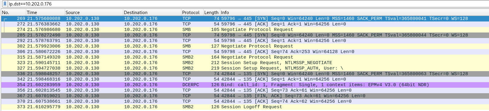

Voici les paquets emis par ma machine au déclendchement de ma carte réseaux

Je remarque du TCP, J'essaye de suivre les flux TCP 

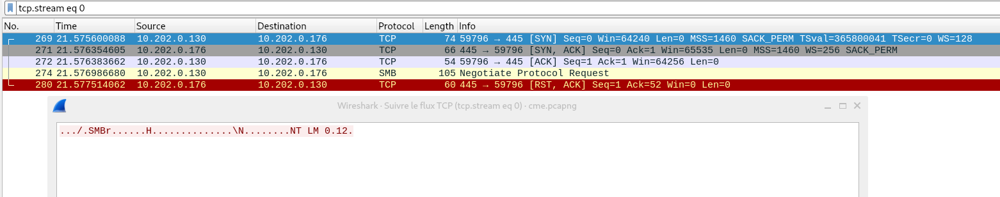

Je remarque qu'il parle de smb (en rapport avec l'énumération du partage smb ) et de NTLM (0.12. Un version ? )
Hypothése du fonctionnement de l'attaque 
Je remarque toute fois que la machine (kali linux ) initie une connexion TCP SYN, le ack l'autorise mais une fois autorisé, il essaye de produire une modification smb qui ne passe pas et la machien castelblack(.176) reset la connexion.

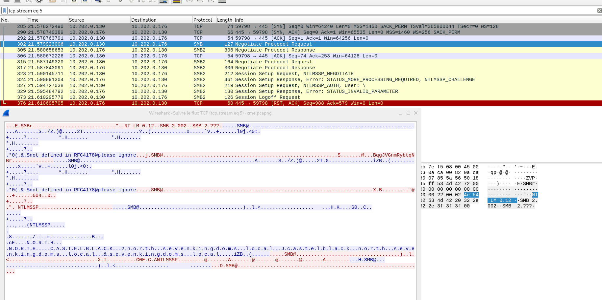

Contrairement à l'hypostèse on peut retracer les actions qui sont effectuées en rapport avec les partage SMB sont présente.

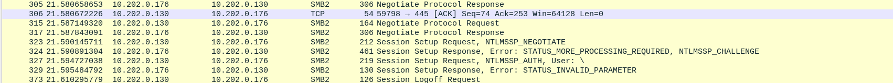

On remarque une tentative de session avec de la communication NTLM pour les partages smb, l'utilisateur qui semble se connecter est User: \, la réponse est une erreur coté client à cause d'aucun utilisateur ou de mot de passe (INVALID PARAMETER)

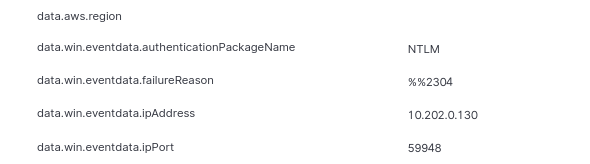

On remarque la précense du NTLM.

La capture wireshark est sur github : cme.pcacng

Les filtres utilisés sont mon IP souce,l'Ip de dest et les séquence TCP  :10.202.0.130 
ip.src==10.202.0.130
ip.dest=10.202.0.176
tcp.stream.eq 5
tcp.stream.eq 0

Une autre attaque  :  Kerberoasting
 

J'utilise les identifiants récupéré dans la partie pentesdugoad pour faire mon attaque 

    cme ldap 10.202.0.150 -u brandon.stark -p 'iseedeadpeople' -d north.sevenkingdoms.local --kerberoasting KERBEROASTING

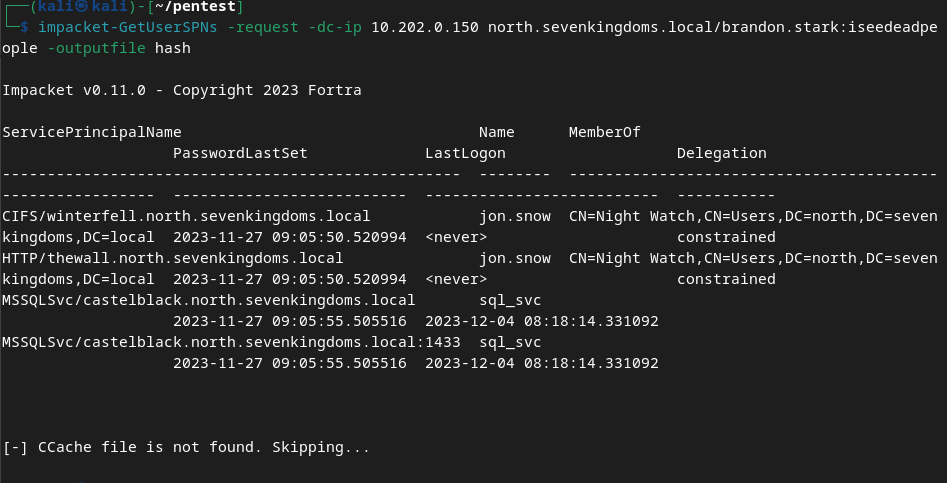

Je récupére les hashs du compte sql_svc et jon.snow grâce à cette attaque, dans mon cas il sont dans le fichier hash.

Nous allons détecter l'attaque sur Wazuh : 

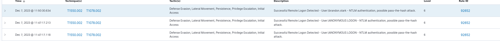

Avec l'information des connexions valides :

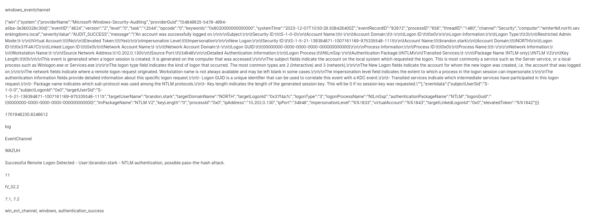

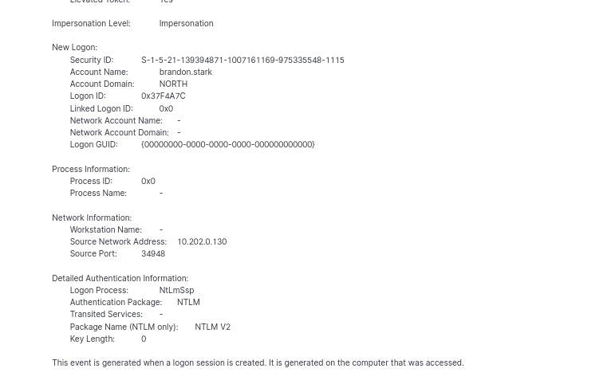

On rermarqie l'utilisation du compte brandon.stark

Les règles Mittre utilisé  :T1550.002, T1078.002
